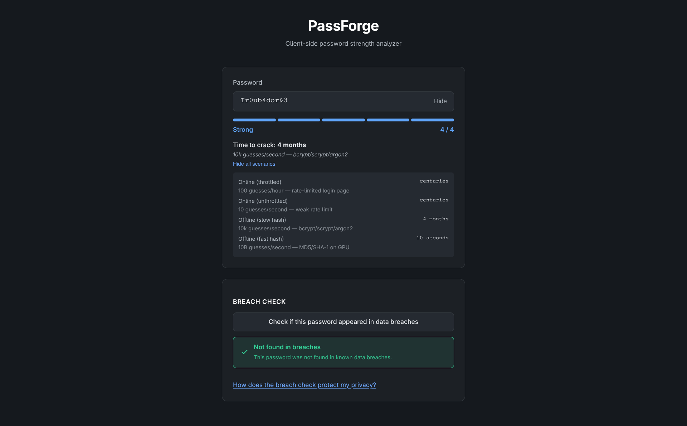
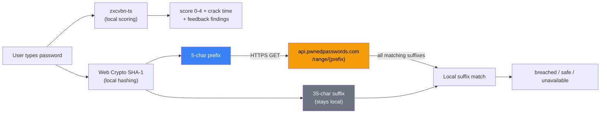

# PassForge

A client-side password strength analyzer that checks breach exposure without your password ever leaving the browser.

PassForge evaluates password strength locally using [zxcvbn-ts](https://github.com/zxcvbn-ts/zxcvbn), then checks breach history via the [Have I Been Pwned](https://haveibeenpwned.com/API/v3#PwnedPasswords) API using k-anonymity — only the first 5 characters of the password's SHA-1 hash are sent over the network. The remaining 35 characters, the full hash, and the password itself never leave your device.

<p align="center">
  
</p>

## Why This Exists

- **Honest strength meter.** Score derived from [zxcvbn's](https://github.com/dropbox/zxcvbn) combinatorial guessing model — not regex rules. Crack-time estimates are computed from raw seconds against four attack scenarios, not cosmetic tiers.
- **k-anonymity by construction.** Breach checks use the HIBP Pwned Passwords range API. Your password is hashed locally with SHA-1 via Web Crypto; only a 5-character prefix (one of 1,048,576 possible) is transmitted. Response padding defeats size-correlation attacks.
- **Never "safe" when unknown.** If the breach check fails (network error, garbage response, empty 200), the UI renders a distinct "unavailable" state with an explicit warning — it never collapses to "safe."
- **No analytics, no storage.** Zero telemetry. Zero third-party scripts. Passwords, hashes, and analysis results are never written to localStorage, sessionStorage, IndexedDB, or cookies. CSP enforced.

## Architecture



## Tech Stack

| Layer       | Technology                                     |
| ----------- | ---------------------------------------------- |
| Core engine | TypeScript (strict), zxcvbn-ts, Web Crypto API |
| Web UI      | React 19, Vite, CSS custom properties          |
| Testing     | Vitest, Testing Library, axe-core, fuzz tests  |
| Monorepo    | pnpm workspaces                                |

## Quickstart

```bash
git clone https://github.com/CeroGravity/PassForge.git
cd PassForge
pnpm install
pnpm dev              # starts Vite dev server on localhost:5173
```

Production build:

```bash
pnpm build            # outputs to apps/web/dist/
pnpm --filter @passforge/web preview   # preview the production build
```

## Deploy

PassForge is a static SPA. The production build (`apps/web/dist/`) can be deployed to any static host. A `_headers` file is included for Netlify/Cloudflare Pages with CSP and security headers pre-configured.

```bash
pnpm build
# Deploy apps/web/dist/ to your static host of choice:
# Netlify:          drag-and-drop dist/ or connect the repo
# Cloudflare Pages: connect repo, build command "pnpm build", output "apps/web/dist"
# Any static host:  serve dist/ — the <meta> CSP fallback works without server headers
```

## Testing

Coverage gate enforces 80% across statements, branches, functions, and lines on the core engine (`all: true`, v8 provider). The HIBP response parser is fuzz-tested with 2,500+ iterations of random/garbage/unicode input. An axe-core audit asserts zero serious or critical accessibility violations.

```bash
pnpm test             # core: 66 tests + coverage gate
pnpm test:web         # web: 9 behavioral + a11y tests
```

## Security & Privacy

- **[Privacy Model](docs/privacy-model.md)** — exactly what data leaves the client (one 5-character hash prefix, nothing else) and how the k-anonymity protocol works.
- **[Threat Model](docs/threat-model.md)** — 11 threats analyzed with mitigations and residual risk: network observation, MITM, malicious responses, storage exposure, XSS, supply chain, and more.
- **[User Manual](docs/user-manual.md)** — how to use PassForge, what each UI element means, and how to interpret results.

## Project Structure

```
packages/core/         Strength scoring, feedback generation, HIBP breach check
apps/web/              Vite + React SPA with design tokens and a11y
shared/test-vectors/   Language-neutral JSON test fixtures
docs/                  Privacy model, threat model, ADRs, user manual, screenshots
```

## License

[MIT](LICENSE)
